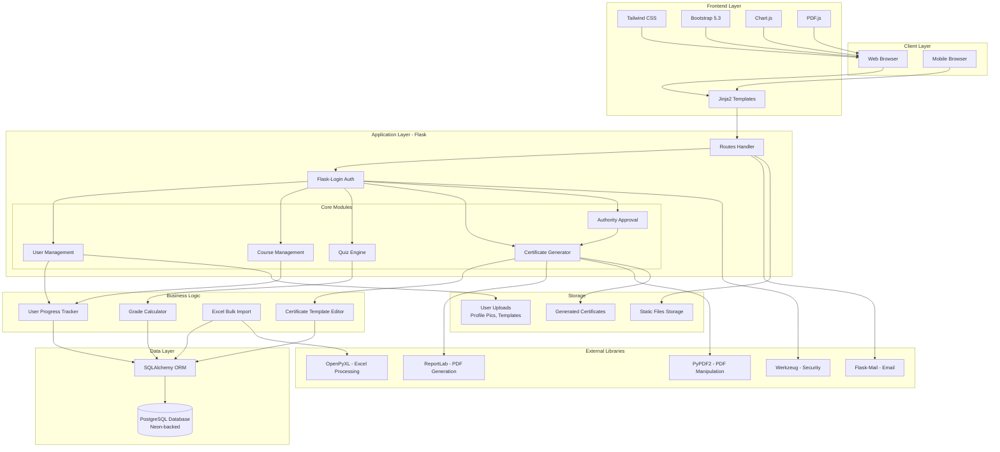
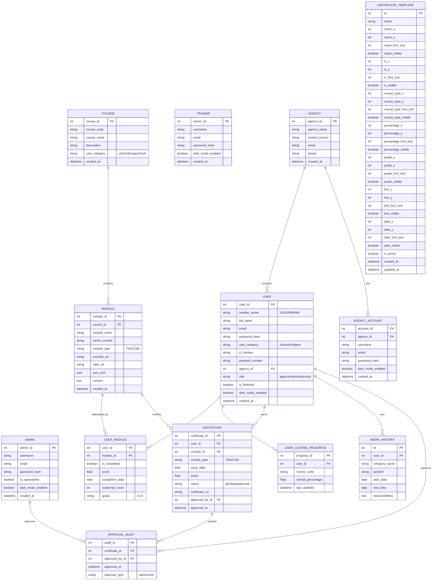
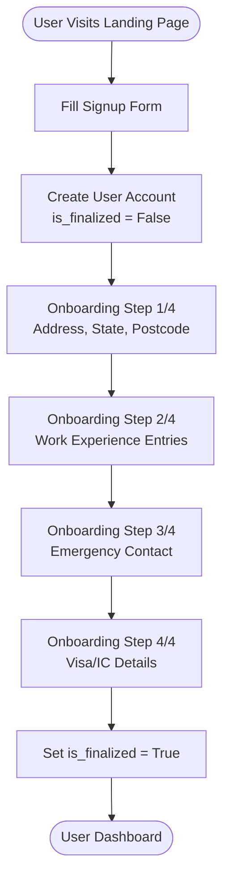
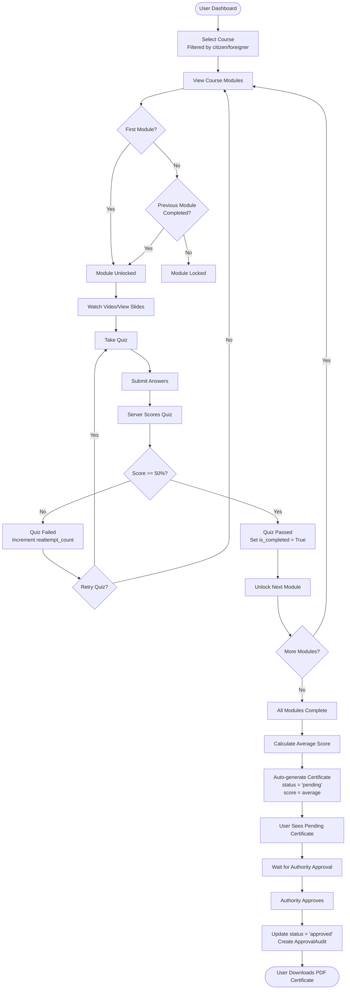
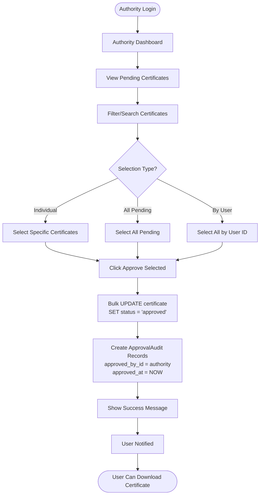
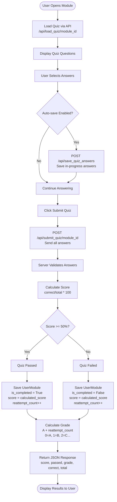
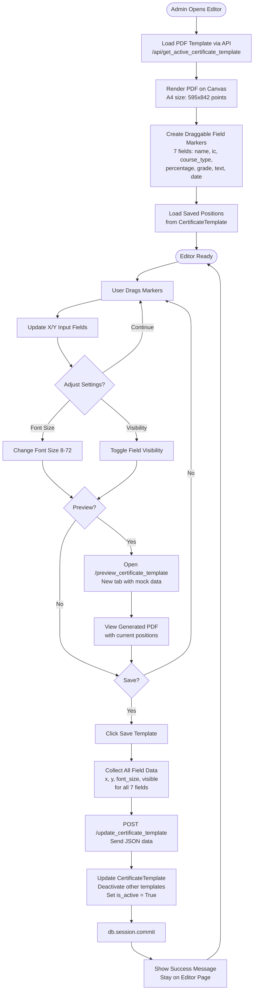
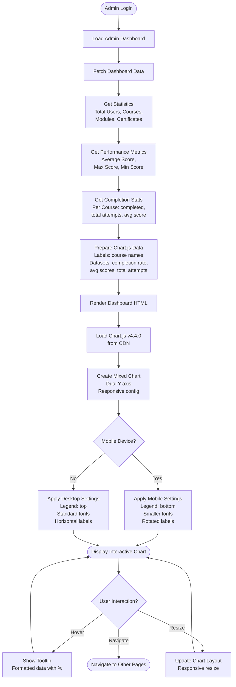

# SHAPADU Security Training System - Technical Diagrams

## Table of Contents
1. [System Architecture Diagram](#system-architecture-diagram)
2. [Entity Relationship Diagram (ERD)](#entity-relationship-diagram-erd)
3. [System Flowcharts](#system-flowcharts)

---

## System Architecture Diagram

---

## Entity Relationship Diagram (ERD)

---

## System Flowcharts

### 1. User Registration & Onboarding Flow

### 2. Course Completion & Certificate Flow

### 3. Certificate Approval Workflow

### 4. Quiz Taking & Grading Flow

### 5. Certificate Template Editor Flow

### 6. Admin Dashboard Analytics Flow

---

## System Components Summary

### Frontend Stack
- **Templates**: Jinja2 with Flask
- **CSS Frameworks**: Tailwind CSS 3.4.18 + Bootstrap 5.3.0
- **JavaScript Libraries**: Chart.js 4.4.0, PDF.js 3.11.174
- **Icons**: Font Awesome

### Backend Stack
- **Framework**: Flask 3.x
- **Authentication**: Flask-Login
- **ORM**: Flask-SQLAlchemy
- **Database**: PostgreSQL (Neon-backed)
- **PDF Processing**: ReportLab, PyPDF2
- **Excel Processing**: openpyxl
- **Email**: Flask-Mail

### Key Features
1. **Multi-role Access Control**: Superadmin, Admin, Trainer, Agency, User, Authority
2. **Sequential Learning**: Module unlocking based on completion
3. **Grading System**: Attempt-based grades (A→B→C with retakes)
4. **Certificate Workflow**: Auto-generation → Pending → Authority Approval → Download
5. **Visual Template Editor**: Drag-and-drop certificate field positioning
6. **Analytics Dashboard**: Chart.js visualizations for admin insights
7. **Bulk Operations**: Excel-based user import, bulk certificate approval
8. **Mobile Responsive**: Full mobile support across all pages

---

**Generated**: November 26, 2025
**Version**: 1.0
**System**: SHAPADU Security Personnel Training Platform
